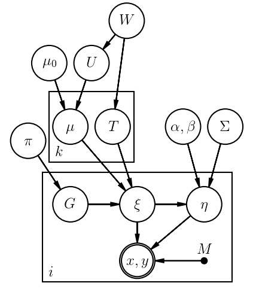
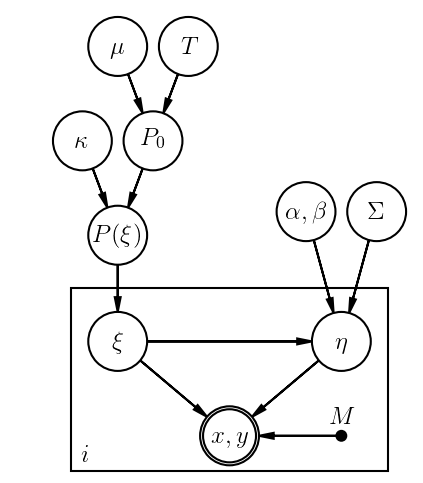

# LRGS: Linear Regression by Gibbs Sampling

[R](https://www.r-project.org/) code implementing a Gibbs sampler to deal with the problem of multivariate linear regression with uncertainties in all measured quantities and intrinsic scatter. Full details can be found in [this paper](http://arxiv.org/abs/1509.00908), the abstract of which appears below.

Kelly (2007, hereafter K07) described an efficient algorithm, using Gibbs sampling, for performing linear regression in the fairly general case where non-zero measurement errors exist for both the covariates and response variables, where these measurements may be correlated (for the same data point), where the response variable is affected by intrinsic scatter in addition to measurement error, and where the prior distribution of covariates is modeled by a flexible mixture of Gaussians rather than assumed to be uniform. Here I extend the K07 algorithm in two ways. First, the procedure is generalized to the case of multiple response variables. Second, I describe how to model the prior distribution of covariates using a Dirichlet process, which can be thought of as a Gaussian mixture where the number of mixture components is learned from the data. I present an example of multivariate regression using the extended algorithm, namely fitting scaling relations of the gas mass, temperature, and luminosity of dynamically relaxed galaxy clusters as a function of their mass and redshift. An implementation of the Gibbs sampler in the R language, called LRGS, is provided. 

For questions, comments, requests, problems, etc. use the [issues](https://github.com/abmantz/lrgs/issues).

## Graphical Model Representations
Just for fun, here are graphical representations of the implemented models. They differ only in the hierarchical structure of the covariate prior distribution. In this representation, random variables are circled, measured quantities are double-circled, and fixed quantities are shown as points.

Gaussian mixture           |  Dirichlet process
:-------------------------:|:-------------------------:
 | 

## Example usage
These examples appear in the R documentation for the Gibbs.regression function. Each one creates a mock data set and then fits a linear model to it, and compares the results to traditional regression. You can see the results, including plots, in [this ipython notebook](./Gibbs_regression_example.ipynb).

```R
## example using the default Ngauss=1 with no measurement errors
x <- rnorm(500, 0, 5)
y <- pi*x + rnorm(length(x), 0, 0.1)
post <- Gibbs.regression(x, y, NULL, 50, trace='bsmt', fix='xy')
m <- lm(y~x)
plot(post$B[1,1,-(1:10)], col=4); abline(h=m$coefficients[1], lty=2, col=2)
plot(post$B[2,1,-(1:10)], col=4); abline(h=m$coefficients[2], lty=2, col=2)
plot(post$Sigma[1,1,-(1:10)], col=4); abline(h=var(m$residuals), lty=2, col=2)
plot(post$mu[1,1,-(1:10)], col=4); abline(h=mean(x), lty=2, col=2)
plot(post$Tau[1,1,1,-(1:10)], col=4); abline(h=var(x), lty=2, col=2)

## verbose example using a Dirichlet process, including measurement errors
## in practice, you would would want a longer chain, i.e. larger nmc
xx <- rnorm(100, c(-15,0,15), 1)
yy <- xx + rnorm(length(xx)) + rnorm(length(xx), 0, 3)
xx <- xx + rnorm(length(xx))
M = list()
for (i in 1:length(xx)) M[[i]] <- matrix(c(1,0,0,1), 2, 2)
nmc = 10
post = Gibbs.regression(xx, yy, M, nmc, dirichlet=TRUE, trace='bsgmta', mention.every=1)
plot(xx, yy, col=post$G[,nmc]) # plot clusters at the last iteration
m <- lm(yy~xx)
plot(post$B[1,1,-1], col=4); abline(h=m$coefficients[1], lty=2, col=2)
plot(post$B[2,1,-1], col=4); abline(h=m$coefficients[2], lty=2, col=2)
plot(post$Sigma[1,1,-1], col=4); abline(h=var(m$residuals), lty=2, col=2)
plot(post$mu[1,1,-1], col=4); abline(h=mean(xx), lty=2, col=2)
plot(post$Tau[1,1,1,-1], col=4); abline(h=var(xx), lty=2, col=2)
plot(post$alpha[-1], col=4)
```
